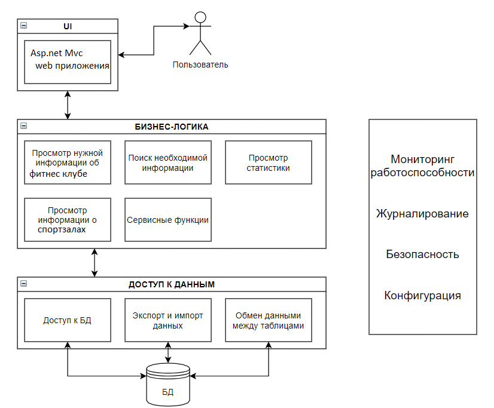
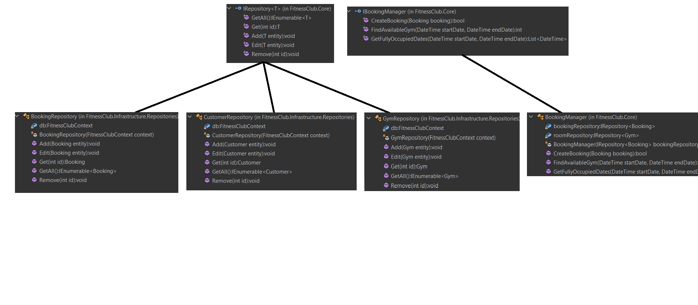
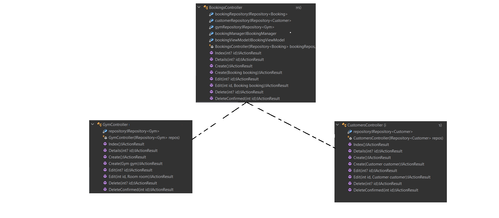
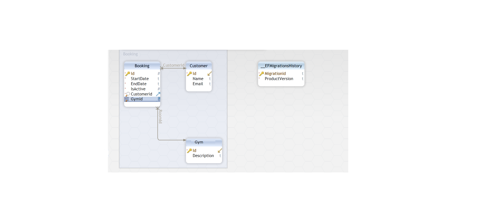

## Лабораторная работа № 2

### Описание типа приложения и выбранного технологического стека (Console App/Desktop/Mobile/Web MPA/ Web SPA/Cross-platform)
Тип приложения - Web MVC

Технологический стек - C#, Asp.net, MVC

В качестве СУБД выбор сделан в строну Sqlite.

В качестве языка программирования выбор сделан в сторону C#. он объектно-ориентированный, что позволяет использовать наследование, интерфейсы, абстракции и т.д

### Верхнеуровневое разбиение на компоненты (в будущем может быть утонченно): на базовом уровне выделяем компонент доступа к данным, компонент бизнес-логики и компонент реализации UI

### UML диаграммы классов для двух отдельных компонентов - компонента доступа к данным и компонента с бизнес-логикой
#### Компонент доступа к данным

#### Компонент с бизнес-логикой

### UML диаграммы «модельных» классов сущностей: сущности базы данных, сущности системы и транспортные сущности. Если уровень транспортных сущностей пока сложно спроектировать, можно скопировать системные. Уточните их на следующих этапах

#### Сущности БД

#### Сущности системы

#### Транспортные сущности